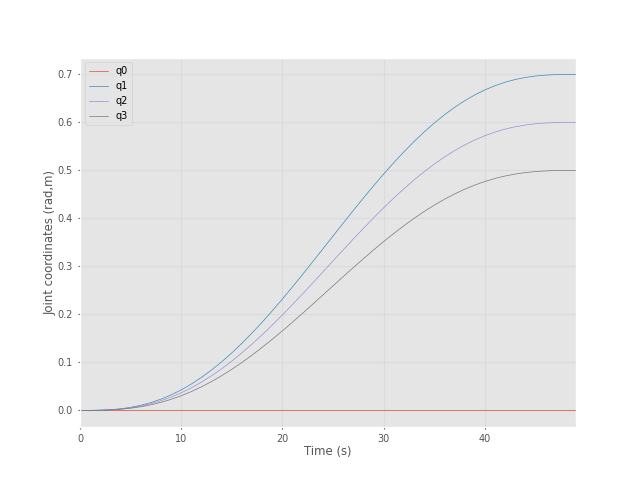
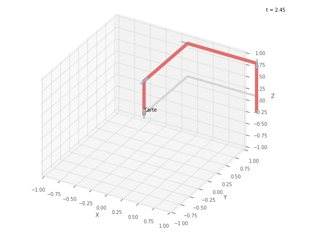
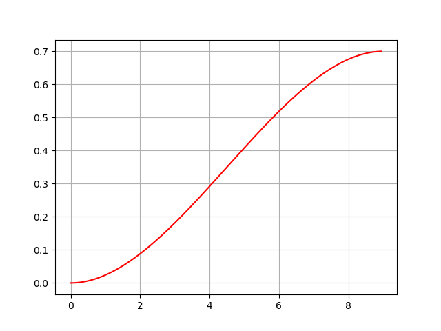
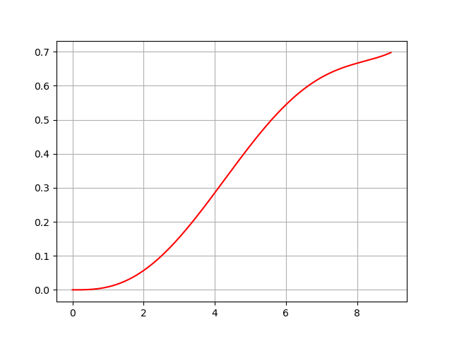

# PATH_AND_TRAJECTORY_PLANNING

    Contains Cubic and Quintic Polynomial-Plotting
    
    CARTESIAN_STANDARD IN ROBOTIC TOOLBOX USED BY MR. PETER CORKE

     DIFFERENTIATING PATH AND TRAJECTORY USED BY MR. PETER CORKE AND CUBIC POLYNOMIAL PLOTTING
     
     (CUBIC PRISMATIC)

     (QUINTIC PRISMATIC)
    
